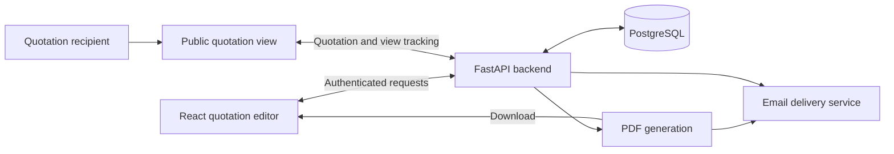

# Cenorama

**A quotation workflow connecting an editable web interface, stored business records and shareable documents.**

[Back to portfolio](../README.md)

## Problem and intended users

Cenorama was created to prepare price quotations for a small engineering company. The workflow brings customer information, reusable items, quantities, prices and document delivery into one application.

## My contribution

My work spans the React frontend and Python backend: quotation entry and editing, API integration, persistence and document-sharing flows. The inspected histories of both repositories attribute commits to MichaelU6. This establishes recorded contributions across both layers, without claiming exclusive authorship of every dependency or component.

## Implemented functionality

1. **Prepare a quotation:** enter or reuse customer details and line items, set quantities, units, prices and an expiry date, and preview the total.
2. **Save and revise:** persist the quotation and its ordered items, assign a quotation number, and edit the customer and item details through the frontend.
3. **Export or share:** request a server-generated PDF or send an email with the quotation document and sharing information. A token-based public view lets recipients open the quotation.
4. **Track follow-up:** list quotations and expose sent status, first/last view timestamps and view counts.

The application also includes password authentication, Google sign-in integration, company lookup, account settings and Stripe subscription integration. These are code-level capabilities; external-service operation was not tested for this portfolio.

## Technical approach

The React interface communicates with a FastAPI backend. Creation calculates the total from submitted quantities and unit prices, creates or reuses the customer's record, saves ordered quotation items and adds previously unseen items to the user's reusable catalogue. SQLAlchemy maps this data to PostgreSQL.

PDF generation and email delivery are separate backend services. The public quotation route retrieves data using a sharing token and records view activity. A view count indicates that the route was accessed; it does not prove that a customer read or accepted the offer.

Despite an AI-related name in a frontend helper, the inspected quotation-creation handler performs ordinary calculations and database operations. This portfolio does not claim AI-generated pricing or quotation content.

**Verified stack:** React, TypeScript, Vite, Chakra UI, Axios and React Router on the frontend; Python, FastAPI, Pydantic, SQLAlchemy, PostgreSQL and ReportLab on the backend. Google authentication and Stripe integrations are present. Docker and frontend Nginx configuration support packaging and serving the application.

## Status and limitations

Both `MichaelU6/offer-tool` and `MichaelU6/offer-tool-ui` were inspected. The quotation creation, editing, PDF, sharing and tracking flows are implemented in code. The application was not launched and no emails, payments or external lookups were triggered during this review. No automated test suite was found in the inspected application file inventory.

One consistency issue needs runtime verification: the primary edit handler updates line items without visibly recalculating the stored quotation total, while the public view reads that stored total. The frontend calculates its displayed total from the items, so edited totals may differ between views. This is an inspection finding, not a reproduced failure.

Successful email delivery, payment lifecycle behaviour, recipient access and document rendering remain unverified here. No deployment, customer-adoption or time-saving claim is made.

**Walkthrough focus:** create and revise a quotation using synthetic customer data, compare editor/public/PDF totals, and demonstrate sharing with an isolated mail sink.
