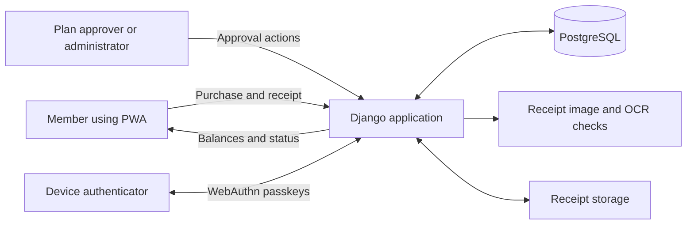

# DHZ PWA

**Purchase planning, approvals and funding visibility for a volunteer fire brigade.**

[Back to portfolio](../README.md)

## Problem and intended users

The core application helps brigade members propose purchases, authorised members approve plans, and administrators review receipts and complete purchases. Funding-source balances show the difference between available funds and money reserved for approved purchases.

## My contribution

My work is represented by the Django application, mobile-oriented interface, purchase workflow, account/session handling and automated application tests. The inspected repository history attributes commits to MichaelU6. This supports recorded development contributions, without asserting sole authorship of every component.

## Core functionality found in code

- **Purchase planning:** submit proposed purchases against a funding source; authorised roles approve the plan after checking available funds.
- **Receipt workflow:** capture or upload a receipt image, apply image and OCR-based checks, and move the purchase into receipt approval.
- **Completion and balances:** administrator approval marks a purchase complete and deducts its amount from the funding source. Database transactions and row locking coordinate these updates.
- **Financial overview:** display balances, reservations and available amounts per funding source and in aggregate.
- **Accounts and roles:** registration, password sign-in, role management, WebAuthn/passkey registration and authentication, plus session locking and unlocking.
- **PWA interface:** a web manifest, icons, responsive templates and a service worker provide the application shell. The worker caches static assets and excludes navigation requests; this does not establish offline purchase submission or offline financial workflows.

## Technical approach

Django renders the pages and handles authenticated requests. Browser JavaScript supports receipt capture, purchase actions and passkeys. Models represent users, funding sources, purchase plans, approvals and receipt references. PostgreSQL stores application records; receipt files are handled through Django's file-storage interface.

**Verified stack:** Python, Django, PostgreSQL, Django templates, JavaScript, IndexedDB for the behavioural experiment, WebAuthn, Pillow and Tesseract through pytesseract. Packaging includes Docker Compose, Gunicorn, WhiteNoise and Caddy. Application tests use Django's test framework; pytest-django and Ruff are included in development dependencies.

## Behavioural biometrics — under development

The experimental component is present in the same repository. Browser code aggregates typing timing and pointer/swipe measurements, builds a local baseline in IndexedDB, compares later activity with that baseline and can request session locking for a further authentication step. A backend test-trace facility stores aggregate experimental results.

This is unfinished behavioural biometrics work, separate from the core purchase application and from WebAuthn/passkeys. The inspected code does not establish reliable identity recognition, acceptable false-positive rates or production-ready biometric authentication. No accuracy or security guarantee is claimed. Because the collector can request session locking, the experiment can affect the user experience even though its purpose is separate from the core workflow.

## Status and limitations

**Owner-reported status:** the core PWA is complete; behavioural biometrics remain under development.

**Code-inspection evidence:** the local `MichaelU6/DHZ-Finance-Aplication` checkout contains the purchase and funding workflow described above, account and passkey handlers, PWA assets and experimental biometric code. Its README describes a narrower account-focused scope, so this case study follows the implementation rather than relying on that description alone.

Tests cover role restrictions, session locking, purchase approvals, reserved funds, receipt handling and balance deductions. Some receipt tests mock the OCR validation step, so they do not demonstrate recognition quality. CI configuration includes linting, framework checks and a container build; its presence is not evidence of a successful run.

The application and tests were not run during this review. Device-specific installation, passkeys, receipt recognition and end-to-end purchase processing still need a controlled demonstration. Core completion is the owner's assessment, not an independently verified deployment result.

**Walkthrough focus:** propose and approve a synthetic purchase, attach a synthetic receipt, complete the purchase and show the balance changes; discuss biometric experiments separately.
