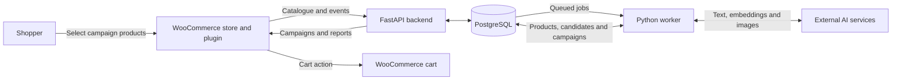

# SalesLoop

**AI-assisted product campaigns and basket recommendations for WooCommerce.**

[Back to portfolio](../README.md)

## Problem and intended users

Store operators need to turn a changing product catalogue into relevant campaign content and product combinations, then understand how shoppers interact with them. SalesLoop connects catalogue synchronisation, model-assisted campaign generation, storefront delivery and reporting.

SalesLoop is the product name; AI-Basket is the implementation name. The backend, WooCommerce integration and separate UI are parts of one project.

## My contribution

My engineering work is represented by the backend's campaign pipeline, product-data integration, job processing and automated tests. The inspected backend history attributes commits to my GitHub identity, MichaelU6. This supports a contribution claim, without establishing sole authorship of every component. The bundled plugin was inspected as an integration artifact; its individual authorship was not independently established.

## Implemented functionality

- **Catalogue synchronisation:** receives WooCommerce product snapshots, creates or updates records, deactivates missing products and schedules embedding work when relevant data changes.
- **Campaign generation:** builds catalogue context, calls external text models for campaign proposals and product-search groups, retrieves matching products, and passes those candidates into model-assisted selection.
- **Background processing:** database-backed jobs separate synchronisation, embeddings, generation, validation, image generation and performance calculations from API requests. Recovery logic handles stale processing jobs.
- **WooCommerce delivery:** the bundled PHP plugin includes store registration, scheduled product sync, a campaign carousel, shopper-triggered cart additions, campaign metadata on order items and event forwarding.
- **Operator views and reporting:** backend routes and bundled admin JavaScript support campaign controls, generation progress, activities, date-based metrics and top-campaign reporting.
- **Feedback processing:** services record impressions, clicks, orders, status changes and refunds. Campaign-performance, experiment-outcome and optimisation code consumes recorded data; its commercial effectiveness has not been established.

## How the components work together

| Component | Responsibility |
| --- | --- |
| External AI models | Produce campaign proposals, product-search descriptions, product selections and campaign images. OpenAI text/embedding integration and Gemini/Replicate image-provider paths are present. |
| Semantic retrieval | Embeds search descriptions and ranks catalogue products using cosine distance over stored embedding arrays in PostgreSQL. It retrieves candidates; it does not execute cart actions. |
| Python backend and worker | Store catalogue and campaign data, coordinate jobs, apply validation, select campaign responses and calculate reporting data. |
| WooCommerce plugin | Synchronise store data, display campaigns, respond to shopper cart actions and forward interaction/order data. |

Retrieved product descriptions and identifiers are passed into the model's selection step. This is a retrieval-grounded generation flow, rather than a standalone semantic search being presented as an autonomous agent. The overall system is an orchestrated application workflow with explicit backend stages.

**Verified stack:** Python, FastAPI, Uvicorn, SQLAlchemy, PostgreSQL, OpenAI SDK and HTTP model integrations, Pillow, PHP, WordPress/WooCommerce, JavaScript and CSS. Docker Compose defines database, API and worker services. Deployment configuration is present; successful deployment was not verified. Retrieval uses PostgreSQL array calculations; a dedicated vector database is not assumed.

## Testing, status and limitations

The local `MichaelU6/AI-Basket` checkout was inspected, including its worker, services, database layer, API, tests and a locally available WooCommerce plugin ZIP under the plugin-package directory. The ZIP was read without extraction or execution. The package-storage documentation indicates release ZIPs are not committed source, so the package is not evidence of the latest plugin release.

The separate `MichaelU6/AI-Basket-UI` repository was unavailable for this review. The UI functionality described here refers specifically to the bundled WooCommerce admin interface, not that uninspected repository.

Tests exist for product-change detection, fallback behaviour, event deduplication, refund-aware outcomes and synthetic optimiser scenarios. The PostgreSQL integration test file contains environment-gated scaffolding, not substantive end-to-end database assertions. No tests or live model calls were run during this review.

Catalogue ingestion, retrieval, campaign generation and plugin actions are supported by code inspection. Compatibility between this plugin package and the current backend, provider configuration, generation quality, attribution accuracy and the full storefront-to-order flow still need an isolated demonstration. Optimisation code and synthetic tests do not establish increased sales or production reliability.

**Walkthrough focus:** follow a synthetic catalogue update through retrieval and campaign selection, then inspect the corresponding job states, cart integration and recorded events.
